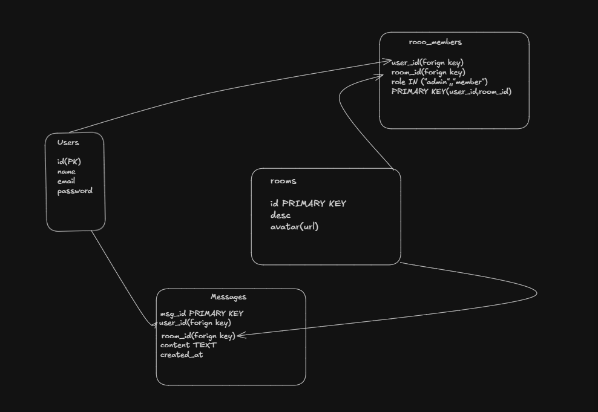

the reason I am Building This is to implement Websockets learning
 
 # ```First
 - The first goal was to create a websocket at client and server side
 -  connecting the client  to server and resonding
 - connectoing multiple browser meanr msg is broadcasted to every browser connected to the ws (Easy bits)
 # ```Second
 - Crating a room is done
 - First thoght was storing array of object containing roomid and User[list of sockets]
- Using array here is really bad practice we obviously dont want duplicates her so useing a set is so obvious here still at v1 i  did used the array then i also found why it more bad because of the nested loops 0(n^2) using set will make sure add and delting becomes fater due less timecomplexities as per my understanding sets are fast 
# ```Third
will  use to maps  one is for going from room id to sockets and another will be socke o room id it will be help us to get while sending msg we dont have to send roomid with it each time joining room and sending msg will be faster has lookup timee has been reduced  
# ```Forth
Implementedd leave fuction which cuts connection from server side  while leaving also implemented a function it removes ther user from other room before ccreating and leaving and also if connection dissconectes from the client ide 
# ```Fifth 
till here i solved evry problem there are still some place  where i can add to check more things but real bottlneck is 
When i broadcast it loops throgh every socket present in the room and as per my understanding about websockets we cannot share in-memory room state across horizontally scaled servers
which are in two diff server we cannot keep them in one room here coomes something called Pub-sub instance  its nothing but traffic is spread between servers and server are all connnect to a pub sub server 
gut 

next Step is adding getting the app from inmem to presistant db so adding pgsql the initial schema i thought was this 


So basically added the pgSQL data base so msg are now persisted and one more thing is add the pub sub and understood more intuitively like pub sub is basically a broker  has which has  connection with all the server instance it uusuallly has two connection on publlishing the events and another to subscribing the events but we still have to main two Maps for sending /broadcasting the msgs


Load Testing
I tested te app using k6 with concurrent users performing the full application flow:
-Register
-Login
-Authenticate via JWT
-Establish a WebSocket connection or upgrding the protocol
-Join a chat room
-Exchange chat messages
Results

Users	Result
100	    Stable
200	    Stable
300	    Registration failures (~19%) and increased latency

The system reliably handled 200 concurrent users executing the complete workflow. At 300 concurrent users, registration became the primary bottleneck while login and WebSocket communication continued to succeed for users who completed registration


During load testing, CPU utilization reached approximately 98%. Likely contributors include password hashing, database operations, Redis messaging, JSON serialization, and broadcasting messages to connected clients. taking alot of memory probably like 200 sockets i think this afe spot to leave this project main goal was to design a system which can be scallable but i dont know how much i acheivedit in this but i can say with surety that it is implemented the basic building blocks required for horizontal scaling    
i have implemnete presistance  of the mssseges and for scalling purpose i have added redis pub sub model which was off the reson to start this basic project at the first place 
and also learnt about handling the http to ws upgradition myself also got to know that express cant handle the upgrade it self 


what i could improve 
- i wanna fix the the structure of the json msg i was sending 
- i could more close to production close by polishing adding more try/catch but the goal for me here is completed 